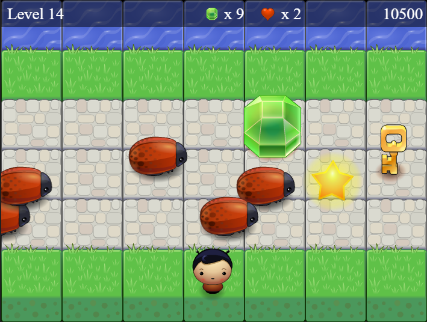

#Welcome to Arcade CLASSICS
===========================

1. ##**HOW TO PLAY :**
   ===============

- When you are ready click on "**Play Now!**".
- Collecting a _Heart_, _Star_ or _Key_ will give you **300** points each.
- Collecting any _Gems_ (blue, green or orange) will get you **300** points each.
- Every time you make it to the other side and reach the river bank safely you move to the next level!!
- On moving to next level you are rewarded with 600 points!
- You are given 3 lives.
- Be careful with the **BUGS!** Avoid colliding with them or you loose **1 life**!!
- If you loose all your lives then the Game is Over.

SO... What are you waiting for??

Gotta Get'em All!!

Enjoy!!

2. ##**TO RUN THE GAME :**
===========================
Click on Link: https://poojar24.github.io/Arcade-Game/ to play!

